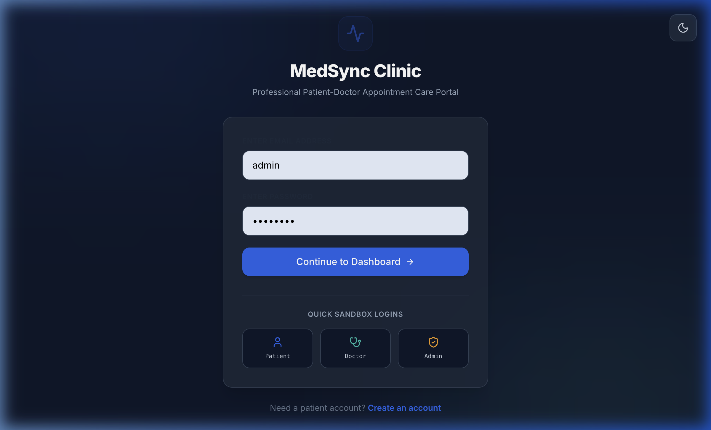
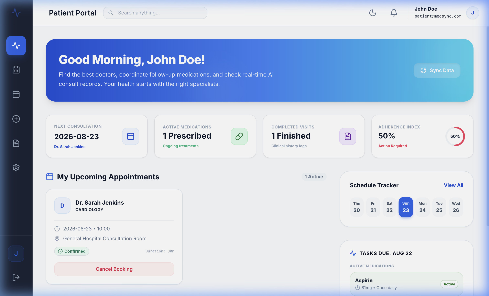
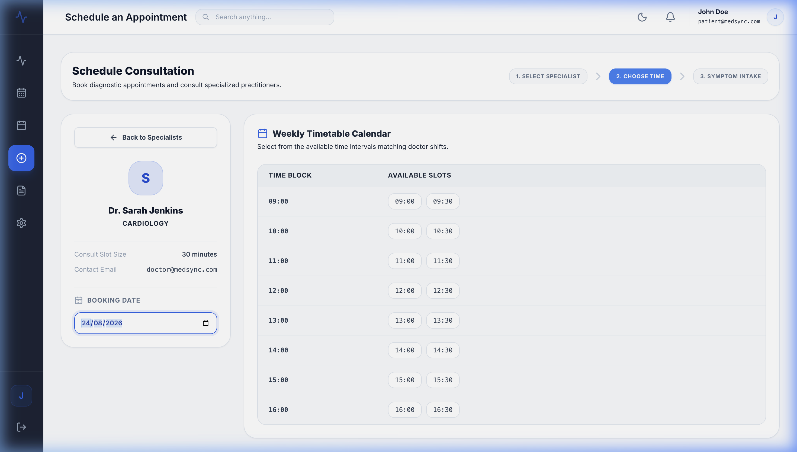
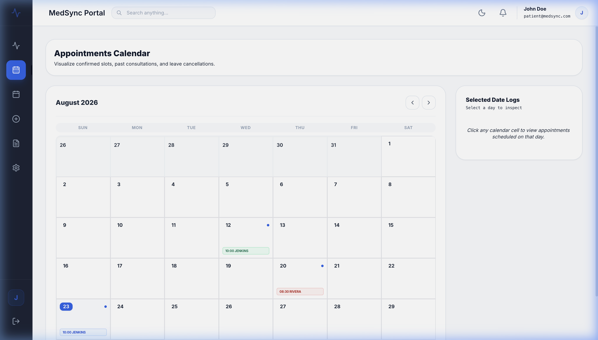
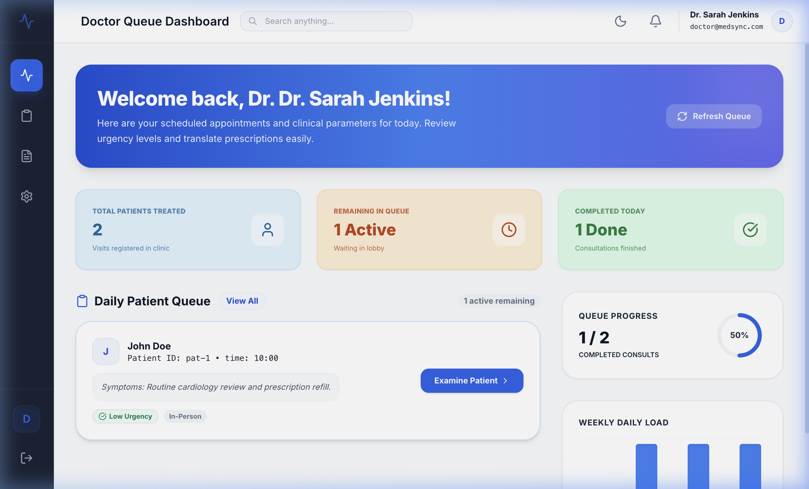
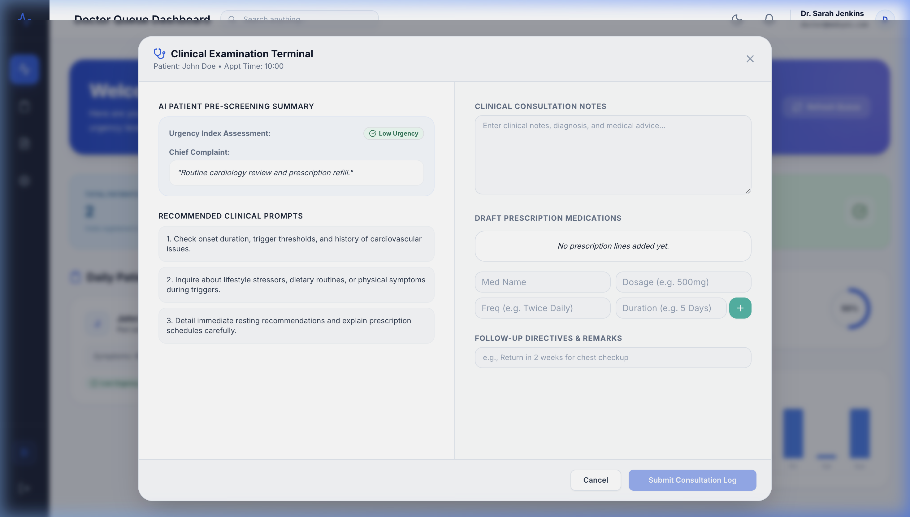
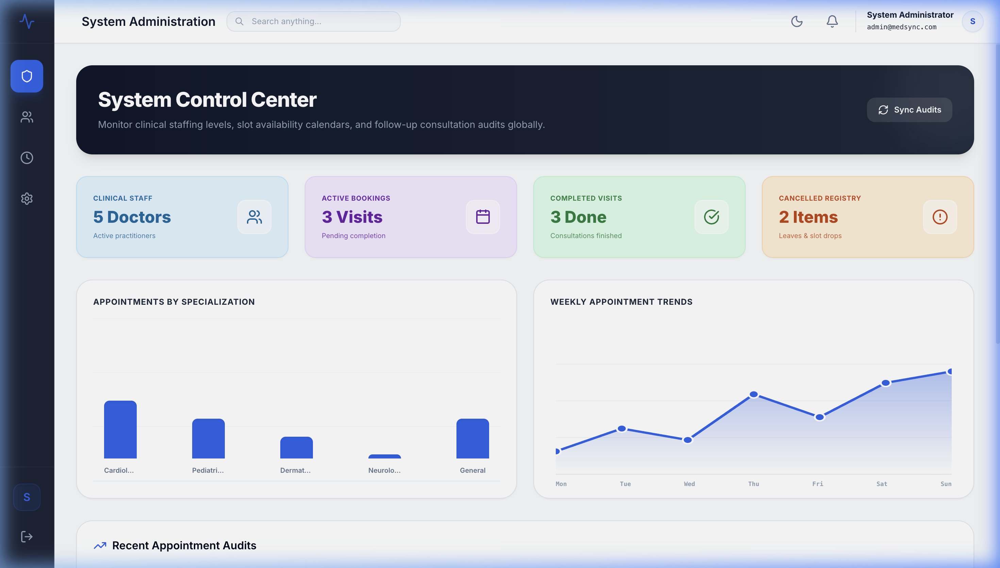
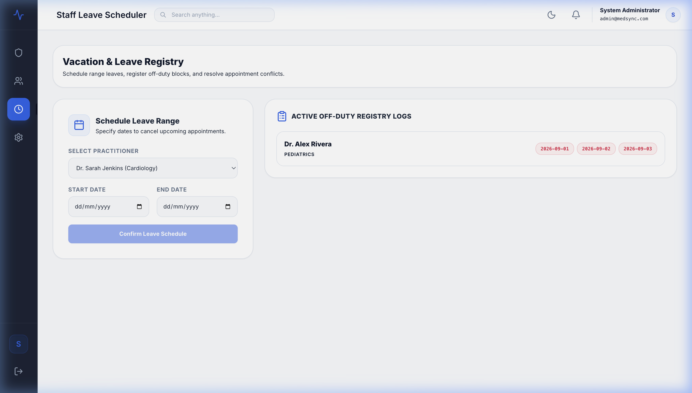

# Medsync - Full-Stack Healthcare Appointment & Follow-Up Manager

Medsync is a premium, responsive full-stack web application designed to streamline doctor appointments, patient symptoms analysis, clinical notes, prescriptions, Google Calendar syncing, and medication reminders. It includes custom, role-based dashboards for Patients, Doctors, and Administrators.

---

## 📸 Application Dashboards & Workflows

Below are snapshots of the Medsync interface showing the user flow and design aesthetic.

### 🔑 Authentication & Portal Entry
*   **Login Portal**: Includes sandbox login credentials to quickly toggle between patient, doctor, and administrator view modes.
    

### 👤 Patient Portal Workflows
*   **Patient Dashboard**: Allows patients to track active appointments, search for doctors, and view active prescriptions.
    
*   **Booking Slot Grid & Specialization Filters**: Enables patients to select and hold doctor slots for 5 minutes during symptom input.
    
*   **Personal Calendar View**: Displays clinical schedules and follow-up consultation timelines on an interactive calendar.
    

### 🩺 Doctor Portal Workflows
*   **Doctor Console (Queue Manager)**: Provides doctors with clinical queue timelines and pre-visit AI diagnostics (urgency analysis, chief complaints).
    
*   **Clinical Consultation & Prescription Form**: Allows doctors to record notes, define medication schedules, and prescribe drugs.
    

### 🛠️ Admin Portal Workflows
*   **Admin Dashboard**: Empowers administrators to manage profiles, adjust working shifts, and change slot durations.
    
*   **Leave Conflict Resolver & Vacations Scheduler**: Registers doctor leaves, scans active slots, and performs cascading cancellations/notifications.
    

---

## ⚡ Concurrency & Resiliency (Core Features)

*   **Atomic Booking (Double-Booking Prevention)**: Employs database-level isolation transactions (`prisma.$transaction`) to handle simultaneous slot requests safely. Try running the stress test script to see this in action.
*   **Slot Hold Lock**: Locks selected slots for 5 minutes during symptom input to prevent race conditions.
*   **LLM Fail-Safe (Gemini)**: Symptom analysis and post-visit summaries operate asynchronously, reverting to local rule-based evaluations if the Gemini API fails or is unconfigured.
*   **Asynchronous Notification Retries (Nodemailer)**: Queues email tasks using background workers (with in-memory fallbacks) to retry delivery up to 5 times.
*   **Google Calendar Sync**: Integrates with the Google Calendar API using OAuth 2.0. If the connection fails or is not linked, booking workflows continue smoothly.

---

## 🛠️ Technology Stack

*   **Frontend**: React, TypeScript, Vite, Tailwind CSS, React Router, Axios, Lucide Icons
*   **Backend**: Node.js, Express.js, TypeScript, REST APIs, Zod, BullMQ, ioredis
*   **Database**: PostgreSQL (Prisma ORM) / SQLite for local fallback
*   **AI**: Google Gemini API (via `@google/generative-ai` SDK)
*   **Mails**: SendGrip (SMTP transporter with auto Ethereal fallback)
*   **Calendar**: Google Calendar API (OAuth 2.0)

---

## 📦 System Architecture

```text
                  Vite + React Frontend (Port 5173)
                                 │
                                 │ REST API (CORS enabled)
                                 ▼
                  Express + TS Backend (Port 5050)
                                 │
           ┌─────────────────────┼─────────────────────┐
           ▼                     ▼                     ▼
      PostgreSQL               BullMQ               External APIs
     (Prisma ORM)          (Redis / Local)               │
                                                ┌────────┼────────┐
                                                ▼        ▼        ▼
                                             Gemini    Google   SMTP
                                              LLM     Calendar (Email)
```

---

## ⚙️ Setup & Deployment Instructions

### 1. Clone & Configuration
```bash
git clone <repository-url>
cd Healthcare-Appointment
```

Create a `.env` file in the `backend/` directory:
```bash
cp backend/.env.example backend/.env
```

Set up your keys inside `backend/.env`:
*   `DATABASE_URL`: Your PostgreSQL Connection String.
*   `GEMINI_API_KEY`: Your Gemini API Key from Google AI Studio.
*   `SMTP_HOST`, `SMTP_PORT`, `SMTP_USER` (set to `apikey` if using SendGrid), `SMTP_PASS` (SendGrid API Key), `SMTP_FROM`.
*   `GOOGLE_CLIENT_ID`, `GOOGLE_CLIENT_SECRET`, `GOOGLE_REDIRECT_URI` (redirect callback: `http://localhost:5050/api/auth/google/callback`).

---

### 2. Setup Backend & Database
```bash
cd backend
npm install

# Push the schema to your database and generate Prisma Client
npx prisma db push

# Seed the default admin, doctor, and patient accounts
npx prisma db seed

# Start the backend server
npm run dev
```
*The backend server will run on `http://localhost:5050`.*

---

### 3. Setup Frontend
In a new terminal window:
```bash
cd frontend
npm install

# Copy env example and configure VITE_API_URL (defaults to localhost:5050/api if left blank)
cp .env.example .env

# Start the frontend Vite server
npm run dev
```
*The frontend Vite server will start on `http://localhost:5173/`.*

---

## 🧪 Double-Booking Verification (Stress Test)

Medsync includes a pre-packaged concurrency test script to verify that double-booking prevention works under stress:
1. Ensure the backend server is running (`npm run dev` in `backend/`).
2. Run the test command from the `backend/` directory:
   ```bash
   node stress_test_booking.js
   ```
The test issues 5 concurrent bookings for the exact same slot. You will see 1 request succeed (`201 Created`) and 4 fail with `409 Conflict`.

---

## 📄 Database Entity Relationships

```text
User (id, email, password, name, phone, role)
 ├── PatientProfile (id, userId, name, email, phone)
 └── DoctorProfile (id, userId, name, email, specialization, slotDuration, leaveDays)
      ├── DoctorWorkingHour (id, doctorId, dayOfWeek, startTime, endTime)
      └── LeaveRecord (id, doctorId, startDate, endDate, status)

Appointment (id, patientId, doctorId, date, startTime, status, heldUntil)
 ├── SymptomSubmission (id, symptoms, urgency, chiefComplaint, suggestedQuestions, aiStatus)
 ├── Consultation (id, clinicalNotes)
 ├── Prescription (id, followUpInstructions) ───> Medication (id, name, dosage, frequency)
 ├── AISummary (id, summaryText, medicationSchedule, followUpSteps, status)
 └── CalendarEvent (id, googleEventId, htmlLink)
```

---

## 🔌 API Documentation

### Authentication
*   `POST /api/auth/register` - Create patient user.
*   `POST /api/auth/login` - Retrieve JWT token.
*   `GET /api/auth/me` - Fetch profile metadata.
*   `PUT /api/auth/profile` - Update profile settings.
*   `GET /api/auth/google/url` - Generate Google OAuth link URL.
*   `GET /api/auth/google/callback` - Callback handler for Google OAuth.

### Doctor Schedules
*   `GET /api/doctors` - Retrieve doctors list.
*   `GET /api/doctors/:id/availability?date=YYYY-MM-DD` - Get empty slots.
*   `POST /api/doctors/:id/leave-range` - Mark administrator leave day range.
*   `POST /api/doctors/:id/cancel-leave` - Cancel leave range early.
*   `GET /api/doctors/:id/leaves` - View leave histories.

### Appointments
*   `POST /api/appointments/hold` - Create a temporary 5-min slot hold lock.
*   `POST /api/appointments/:id/confirm` - Submit symptoms and confirm booking.
*   `POST /api/appointments/:id/reschedule` - Shift slot atomically.
*   `POST /api/appointments/:id/cancel` - Cancel appointment and free timeslot.

### Consultations
*   `POST /api/appointments/:id/consultation` - Submit notes, prescription, and medications.
